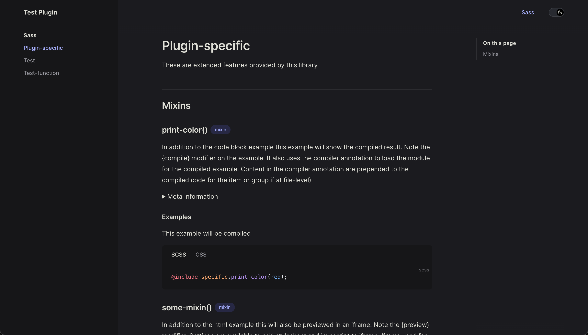
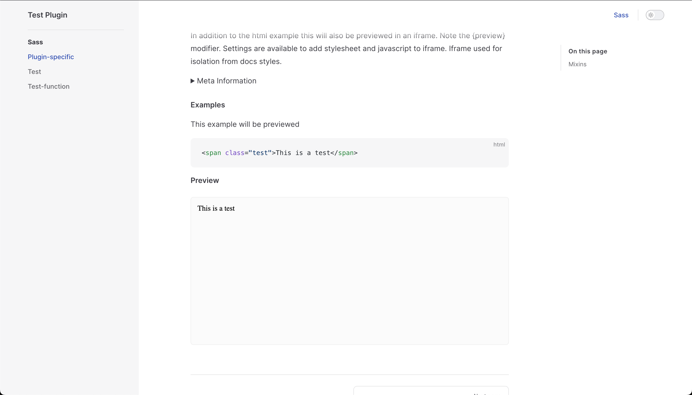

# Vitepress Sassdocs

Creates pages for sassdoc groups in Vitepress (as markdown). Supports all annotations, custom annotations, groups display name and description, as well as content blocks in content. Items organized by type (variable, mixin, etc).


## Contents

- [Vitepress Sassdocs](#vitepress-sassdocs)
  - [Contents](#contents)
  - [Details](#details)
  - [Features](#features)
  - [Usage Example](#usage-example)
  - [Compiled Sassdoc Example](#compiled-sassdoc-example)
  - [Example Previews](#example-previews)
  - [Change Log](#change-log)

## Details


This script extends the [@ulu/sassdoc-to-markdown](https://www.npmjs.com/package/@ulu/sassdoc-to-markdown) package. Refer to it for options. This package adds the following options:

- previewEnabled : {Boolean} 
- previewStyles : {String} : Styles applied to preview iframe (container)
- previewHead : {String} : What you would want to include in preview iframe head (styles, meta, etc)
- previewScripts : {String} : Scripts to include in the bottom of the preview body

If you encounter bugs or have a feature request, feel free to open an issue on github. Readme was done quickly more details, better documentation to follow.





## Features

- Compiled Sass examples (Dart Sass) 
- Compiled examples can be configured to use your own implementation, see options (ie. if using node-sass for example)
- Preview HTML examples (demos, etc)
- Content blocks between documented items
- Custom group display names by adding dash ie `/// @group util - Shared Utilities`
- Group descriptions pulled from lines after group definition (you can also use content blocks to describe groups)
- Ability to override annotation and page templates
- Can be used multiple times (useful for dividing things up into different 'pathBase')

## Usage Example

Script that will output the markdown pages. 

```js
import fs from "fs-extra";
import path from "path";
import { fileURLToPath } from "url";
import { outputPages } from "@ulu/vitepress-sassdoc";

const __dirname = path.dirname(fileURLToPath(import.meta.url));

const options = {
  // Path to scss source files
  dir: path.resolve(__dirname, "scss/"),
  // Path to output to
  dist: path.resolve(__dirname, "docs/"),
  // Path in Vitepress app (see notes below)
  pathBase: "/scss/"
};

const outputDir = path.join(options.dist, options.pathBase);

function cleanOutputDir() {
  const dir = fs.readdirSync(outputDir);
  dir.forEach(item => {
    const fullpath = path.join(outputDir, item);
    // Delete if directory (was created by this package)
    if (fs.lstatSync(fullpath).isDirectory()) {
      fs.removeSync(fullpath);
    }
  });
}

(async () => {
  try {
    cleanOutputDir();
    await outputPages(options);
  } catch (error) {
    console.log(error);
  }
})();

```

You need to specify the "pathBase" in options defaults to /sass/. If the pathBase is "/sass/", you will need to create the directory ie "/sass/index.md". This is the base path for all pages created by the library. To break up into multiple directories, use the outputPages multiple times targeting the desired files. Keep in mind you can exclude files in the 'sassdocOptions' object.


## Compiled Sassdoc Example

```scss
/// In addition to the code block example this example will show the compiled result. Note the  {compile} modifier on the example. It also uses the compiler annotation to load the module for the compiled example. Content in the compiler annotation are prepended to the compiled code for the item or group if at file-level)
/// @compiler
///   @use "_this-file" as examples;
/// @example scss {compile} This example will be compiled
///   @include examples.print-color(red);

@mixin  print-color($value) {
  .test {
    color: $value;
  }
}
```

## Example Previews

**Note:** for previews you need to configure (previewStyles, previewHead, previewScript). These are injected into the preview iframe. This how you include your stylesheets etc.

*See the "/test/" directory in this repo for example usage*

```scss
/// In addition to the html example this will also be previewed in an iframe. Note the {preview} modifier. Settings are available to add stylesheet and javascript to iframe. Iframe used for isolation from docs styles. 
/// @example html {preview} This example will be previewed
///   <span class="test">This is a test</span>

@mixin  some-mixin($value) {}
```


## Change Log

[Change Log](CHANGELOG.md)